## react-native-calendar

A `<Calendar>` component for React Native

Portrait mode only

## Installation

`npm install react-native-calendar --save`

## Usage
```javascript
<Calendar
  customStyle={{day: {fontSize: 15, textAlign: 'center'}}} // Customize any pre-defined styles
  dayHeadings={Array}               // Default: ['S', 'M', 'T', 'W', 'T', 'F', 'S']
  eventDates={['2015-07-01']}       // Optional array of moment() parseable dates that will show an event indicator
  events={[{date:'2015-07-01', ..}]}// Optional array of event objects with a date property and custom styles for the event indicator
  monthNames={Array}                // Defaults to english names of months
  nextButtonText={'Next'}           // Text for next button. Default: 'Next'
  onDateSelect={(date) => this.onDateSelect(date)} // Callback after date selection
  onSwipeNext={this.onSwipeNext}    // Callback for forward swipe event
  onSwipePrev={this.onSwipePrev}    // Callback for back swipe event
  onTouchNext={this.onTouchNext}    // Callback for next touch event
  onTouchPrev={this.onTouchPrev}    // Callback for prev touch event
  prevButtonText={'Prev'}           // Text for previous button. Default: 'Prev'
  scrollEnabled={true}              // False disables swiping. Default: False
  selectedDate={'2015-08-15'}       // Day to be selected
  showControls={true}               // False hides prev/next buttons. Default: False
  showEventIndicators={true}        // False hides event indicators. Default:False
  startDate={'2015-08-01'}          // The first month that will display. Default: current month
  titleFormat={'MMMM YYYY'}         // Format for displaying current month. Default: 'MMMM YYYY'
  today={'2016-16-05'}              // Defaults to today
  weekStart={1} // Day on which week starts 0 - Sunday, 1 - Monday, 2 - Tuesday, etc, Default: 1
/>
```

## Available custom styles

There are a number of pre-defined styles in the calendar. Below, we will give an example of how each of them can be changed depending on your use case.

### calendarContainer

`calendarContainer` changes the background of the calendar.

```js
const Schedule = () => {
  const customStyle = {
    calendarContainer: {
      backgroundColor: 'blue',
    },
  }
  return <Calendar customStyle={customStyle} />
}
```

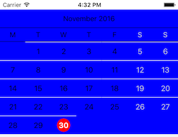

### calendarControls

`calendarControls` changes only the bar on the top that contains the month and year by default, but can also contain controls for changing the month.

```js
const Schedule = () => {
  const customStyle = {
    calendarControls: {
      backgroundColor: 'blue',
    },
  }
  return <Calendar customStyle={customStyle} />
}
```


### calendarHeading

`calendarHeading` changes the bar that contains the days of the week.

```js
const Schedule = () => {
  const customStyle = {
    calendarHeading: {
      backgroundColor: 'blue',
    },
  }
  return <Calendar customStyle={customStyle} />
}
```

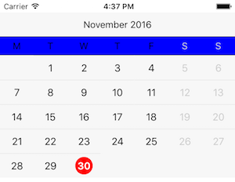

### controlButton

`controlButton` shows the next and previous buttons that allow you to change the current month. The `showControls` prop must be passed through to `<Calendar />` in order for this style to take effect.

```js
const Schedule = () => {
  const customStyle = {
    controlButton: {
      backgroundColor: 'blue',
    },
  }
  return (
    <Calendar
      showControls
      customStyle={customStyle} />
  )
}
```

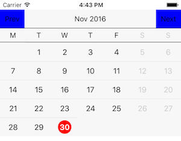

### controlButtonText

`controlButtonText` applies styles to the text that is rendered when the `showControls` prop is `true`. The text can also be changed using the `prevButtonText` and `nextButtonText` props.

```js
const Schedule = () => {
  const customStyle = {
    controlButtonText: {
      color: 'blue',
    },
  }
  return (
    <Calendar
      showControls
      customStyle={customStyle} />
  )
}
```


### currentDayCircle

`currentDayCircle` changes the style of the background behind the currently-selected day *when the currently-selected day is today*.

```js
const Schedule = () => {
  const customStyle = {
    currentDayCircle: {
      backgroundColor: 'blue',
    },
  }
  return <Calendar customStyle={customStyle} />
}
```


### currentDayText

`currentDayText` changes the style of the current day (defaults to `red`) to differentiate it from other days.

```js
const Schedule = () => {
  const customStyle = {
    currentDayText: {
      color: 'blue',
    },
  }
  return <Calendar customStyle={customStyle} />
}
```


### day

`day` changes the text of every day other than today and weekend days.

```js
const Schedule = () => {
  const customStyle = {
    day: {
      color: 'blue',
    },
  }
  return <Calendar customStyle={customStyle} />
}
```

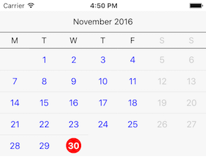

### dayButton

`dayButton` changes the background behind all valid days.

```js
const Schedule = () => {
  const customStyle = {
    dayButton: {
      backgroundColor: 'blue',
    },
  }
  return <Calendar customStyle={customStyle} />
}
```


### dayButtonFiller

`dayButtonFiller` styles the background behind all invalid days.

```js
const Schedule = () => {
  const customStyle = {
    dayButtonFiller: {
      backgroundColor: 'blue',
    },
  }
  return <Calendar customStyle={customStyle} />
}
```

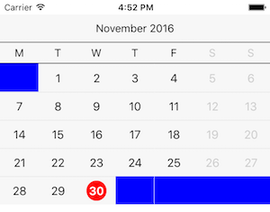

### dayCircleFiller

`dayCircleFiller` styles a circle around all days other than the active day.

```js
const Schedule = () => {
  const customStyle = {
    dayCircleFiller: {
      backgroundColor: 'blue',
    },
  }
  return <Calendar customStyle={customStyle} />
}
```

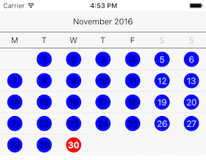

### dayHeading

`dayHeading` styles the text for non-weekend days in the day of the week bar.

```js
const Schedule = () => {
  const customStyle = {
    dayHeading: {
      color: 'blue',
    },
  }
  return (
    <Calendar
    showEventIndicators
    customStyle={customStyle} />
  )
}
```

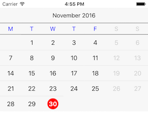

### eventIndicator

`eventIndicator` styles the event indicator bubble for days that have events. Must pass either an `events` array or `eventDates` array and have `showEventIndicators` passed as `true` for the event indicators to display.

```js
const Schedule = () => {
  const customStyle = {
    eventIndicator: {
      backgroundColor: 'blue',
      width: 10,
      height: 10,
    },
  }
  return (
    <Calendar
      showEventIndicators
      eventDates={['2016-11-01', '2016-11-07', '2016-11-19']}
      customStyle={customStyle} />
  )
}
```

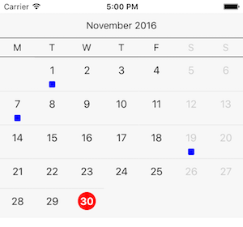

### eventIndicatorFiller

`eventIndicatorFiller` styles the event indicator space for days that do not have events. Must pass `showEventIndicators` as `true` for the event indicators to display.

```js
const Schedule = () => {
  const customStyle = {
    eventIndicatorFiller: {
      backgroundColor: 'blue',
      width: 10,
      height: 10,
    },
  }
  return (
    <Calendar
      showEventIndicators
      eventDates={['2016-11-01', '2016-11-07', '2016-11-19']}
      customStyle={customStyle} />
  )
}
```

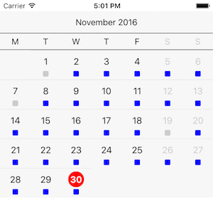

### hasEventCircle

`hasEventCircle` styles the circle around the days that have events associated with them. Must pass either an `events` array or `eventDates` array and have `showEventIndicators` passed as `true` for the event indicators to display.

```js
const Schedule = () => {
  const customStyle = {
    hasEventCircle: {
      backgroundColor: 'blue',
    },
  }
  return (
    <Calendar
      showEventIndicators
      eventDates={['2016-11-01', '2016-11-07', '2016-11-19']}
      customStyle={customStyle} />
  )
}
```

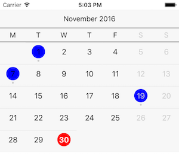

### hasEventDaySelectedCircle

`hasEventDaySelectedCircle` styles the circle around the selected day that have events associated with them. Must pass either an `events` array or `eventDates` array and have `showEventIndicators` passed as `true` for the event indicators to display.

```js
const Schedule = () => {
  const customStyle = {
    hasEventCircle: {
      backgroundColor: 'blue',
    },
    hasEventDaySelectedCircle: {
      backgroundColor: 'red',
  	},
  }
  return (
    <Calendar
      showEventIndicators
      eventDates={['2016-12-03', '2016-12-21', '2016-12-22', '2016-12-30']}
      customStyle={customStyle} />
  )
}
```


### hasEventText

`hasEventText` styles the text of the days that have events associated with them. Must pass either an `events` array or `eventDates` array and have `showEventIndicators` passed as `true` for the event indicators to display.

```js
const Schedule = () => {
  const customStyle = {
    hasEventText: {
      backgroundColor: 'blue',
    },
  }
  return (
    <Calendar
      showEventIndicators
      eventDates={['2016-11-01', '2016-11-07', '2016-11-19']}
      customStyle={customStyle} />
  )
}
```

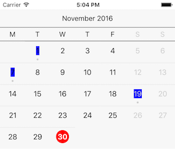

### monthContainer

`monthContainer` styles the background behind the month.

```js
const Schedule = () => {
  const customStyle = {
    monthContainer: {
      backgroundColor: 'blue',
    },
  }
  return <Calendar customStyle={customStyle} />
}
```


### selectedDayCircle

`selectedDayCircle` styles the circle behind any selected day other than today.

```js
const Schedule = () => {
  const customStyle = {
    selectedDayCircle: {
      backgroundColor: 'blue',
    },
  }
  return <Calendar customStyle={customStyle} />
}
```

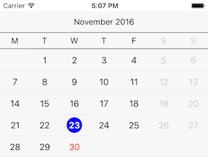

### selectedDayText

`selectedDayText` styles the text of the currently-selected day.

```js
const Schedule = () => {
  const customStyle = {
    selectedDayText: {
      color: 'blue',
    },
  }
  return <Calendar customStyle={customStyle} />
}
```


### title

`title` styles the title at the top of the calendar.

```js
const Schedule = () => {
  const customStyle = {
    title: {
      color: 'blue',
    },
  }
  return <Calendar customStyle={customStyle} />
}
```

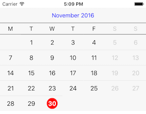

### weekendDayText

`weekendDayText` styles the text of weekends.

```js
const Schedule = () => {
  const customStyle = {
    weekendDayText: {
      color: 'blue',
    },
  }
  return <Calendar customStyle={customStyle} />
}
```

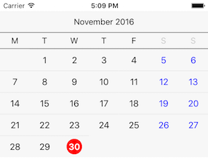

### weekendHeading

`weekendHeading` styles the text of the weekend heading.

```js
const Schedule = () => {
  const customStyle = {
    weekendHeading: {
      color: 'blue',
    },
  }
  return <Calendar customStyle={customStyle} />
}
```


### weekRow

`weekRow` styles the background of the row associated with each week.

```js
const Schedule = () => {
  const customStyle = {
    weekRow: {
      backgroundColor: 'blue',
    },
  }
  return <Calendar customStyle={customStyle} />
}
```


## TODOS

- [ ] Improve swipe feature
- [ ] Landscape support
- [ ] Language support

## DEMO

